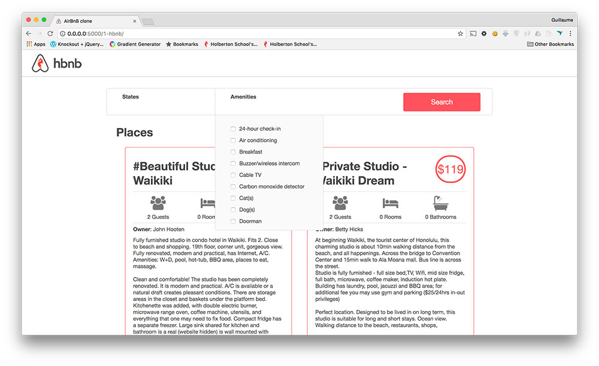

# Project: 0x06. AirBnB clone - Web dynamic

## Resources

#### Read or watch:

- [Selector](https://jquery-tutorial.net/selectors/using-elements-ids-and-classes/)
- [Get and set content](https://jquery-tutorial.net/dom-manipulation/getting-and-setting-content/)
- [Manipulate CSS classes](https://jquery-tutorial.net/dom-manipulation/getting-and-setting-css-classes/)
- [Manipulate DOM elements](https://jquery-tutorial.net/dom-manipulation/the-append-and-prepend-methods/)
- [Document ready](https://learn.jquery.com/using-jquery-core/document-ready/)
- [Introduction](https://jquery-tutorial.net/ajax/introduction/)
- [GET & POST request](https://jquery-tutorial.net/ajax/the-get-and-post-methods/)
- [HTTP access control (CORS)](https://developer.mozilla.org/en-US/docs/Web/HTTP/CORS)

## Learning Objectives

### General

- How cool it is to request your own API
- How to modify an HTML element style
- How to get and update an HTML element content
- How to modify the DOM
- How to make a `GET` request with JQuery Ajax
- How to make a `POST` request with JQuery Ajax
- How to listen/bind to DOM events
- How to listen/bind to user events

## Tasks

0. [Last clone!](../web_dynamic/) :

A new codebase again? Yes!

For this project you will fork this [codebase](https://github.com/jzamora5/AirBnB_clone_v3):

- Update the repository name to `AirBnB_clone_v4`
- Update the `README.md`:
  - Add yourself as an author of the project
  - Add new information about your new contribution
  - Make it better!
- If you’re the owner of this codebase, create a new repository called `AirBnB_clone_v4` and copy over all files from `AirBnB_clone_v3`
- If you didn’t install Flasgger from the previous project, it’s time! `sudo pip3 install flasgger`

1. [Cash only](./0-hbnb.py), [templates/0-hbnb.html](./templates/0-hbnb.html) :

Write a script that starts a Flask web application:

- Based on `web_flask`, copy: `web_flask/static`, `web_flask/templates/100-hbnb.html`, `web_flask/__init__.py` and `web_flask/100-hbnb.py` into the `web_dynamic` folder
- Rename `100-hbnb.py` to `0-hbnb.py`
- Rename `100-hbnb.html` to `0-hbnb.html`
- Update `0-hbnb.py` to replace the existing route to `/0-hbnb/`

**If `100-hbnb.html` is not present, use `8-hbnb.html` instead**

```sh
guillaume@ubuntu:~/AirBnB_v4$ HBNB_MYSQL_USER=hbnb_dev HBNB_MYSQL_PWD=hbnb_dev_pwd HBNB_MYSQL_HOST=localhost HBNB_MYSQL_DB=hbnb_dev_db HBNB_TYPE_STORAGE=db python3 -m web_dynamic.0-hbnb
* Running on http://0.0.0.0:5000/ (Press CTRL+C to quit)
....
```

One problem now is the asset caching done by Flask.

To avoid that, you will add a query string to each asset:

In `0-hbnb.py`, add a variable `cache_id` to the `render_template`. The value of this variable must be an UUID (`uuid.uuid4()`)

In `0-hbnb.html`, add this variable `cache_id` as query string to each `<link>` tag URL

```sh
guillaume@ubuntu:~/AirBnB_v4$ curl -s -XGET http://0.0.0.0:5000/0-hbnb/ | head -6
<!DOCTYPE HTML>
<html lang="en">
  <head>
    <meta charset="UTF-8" />
    <link rel="stylesheet" type="text/css" href="../static/styles/4-common.css?e211c9eb-7d17-4f12-85eb-4d50fa50cb1d" />
    <link rel="stylesheet" type="text/css" href="../static/styles/3-header.css?e211c9eb-7d17-4f12-85eb-4d50fa50cb1d" />
guillaume@ubuntu:~/AirBnB_v4$ curl -s -XGET http://0.0.0.0:5000/0-hbnb/ | head -6
<!DOCTYPE HTML>
<html lang="en">
  <head>
    <meta charset="UTF-8" />
    <link rel="stylesheet" type="text/css" href="../static/styles/4-common.css?f834413e-0aa9-4767-b64a-c92db9cb1f82" />
    <link rel="stylesheet" type="text/css" href="../static/styles/3-header.css?f834413e-0aa9-4767-b64a-c92db9cb1f82" />
guillaume@ubuntu:~/AirBnB_v4$
```

2. [Select some Amenities to be comfortable!](./1-hbnb.py), [templates/1-hbnb.html](./templates/1-hbnb.html), [static/scripts/1-hbnb.js](./static/scripts/1-hbnb.js) :

For the moment the filters section is static, let’s make it dynamic!

Replace the route `0-hbnb` with `1-hbnb` in the file `1-hbnb.py` (based on `0-hbnb.py`)

Create a new template `1-hbnb.html` (based on `0-hbnb.html`) and update it:

- Import JQuery in the `<head>` tag
- Import the JavaScript `static/scripts/1-hbnb.js` in the `<head>` tag
  - In `1-hbnb.html` and the following HTML files, add this variable cache_id as query string to the above `<script>` tag
- Add a `<input type="checkbox">` tag to the `li` tag of each amenity
- The new checkbox must be at 10px on the left of the Amenity name
- Add to the `input` tags of each amenity (`<li>` tag) the attribute `data-id=":amenity_id"` => this will allow us to retrieve the Amenity ID from the DOM
- Add to the `input` tags of each amenity (`<li>` tag) the attribute `data-name=":amenity_name"` => this will allow us to retrieve the Amenity name from the DOM

Write a JavaScript script (`static/scripts/1-hbnb.js`):

- Your script must be executed only when DOM is loaded
- You must use JQuery
- Listen for changes on each `input` checkbox tag:
  - if the checkbox is checked, you must store the Amenity ID in a variable (dictionary or list)
  - if the checkbox is unchecked, you must remove the Amenity ID from the variable
  - update the `h4` tag inside the `div` Amenities with the list of Amenities checked

As example:




3. [API status](./2.hbnb.py) :

Before requesting the HBNB API, it’s better to know the status of this one.

Update the API entry point (`api/v1/app.py`) by replacing the current CORS `CORS(app, origins="0.0.0.0")` by `CORS(app, resources={r"/api/v1/_": {"origins": "_"}})`.

Change the route `1-hbnb` to `2-hbnb` in the file `2-hbnb.py` (based on `1-hbnb.py`)

Create a new template `2-hbnb.html` (based on `1-hbnb.html`) and update it:

- Import the JavaScript `static/scripts/2-hbnb.js` in the `<head>` tag (instead of `1-hbnb.js`)
- Add a new `div` element in the `header` tag:
  - Attribute ID should be `api_status`
  - Align to the right
  - Circle of 40px diameter
  - Center vertically
  - At 30px of the right border
  - Background color #cccccc
- Also add a class `available` for this new element in `web_dynamic/static/styles/3-header.css`:
  - Background color `#ff545f`

Write a JavaScript script (`static/scripts/2-hbnb.js`):

- Based on `1-hbnb.js`
- Request `http://0.0.0.0:5001/api/v1/status/`:
  - If in the status is “OK”, add the class `available` to the `div#api_status`
  - Otherwise, remove the class `available` to the `div#api_status`
    To start the API in the port 5001:

```sh
guillaume@ubuntu:~/AirBnB_v4$ HBNB_MYSQL_USER=hbnb_dev HBNB_MYSQL_PWD=hbnb_dev_pwd HBNB_MYSQL_HOST=localhost HBNB_MYSQL_DB=hbnb_dev_db HBNB_TYPE_STORAGE=db HBNB_API_PORT=5001 python3 -m api.v1.app
...
```


4. [Fetch places](./3-hbnb.py) :

Replace the route `2-hbnb` with `3-hbnb` in the file `3-hbnb.py` (based on `2-hbnb.py`)

Create a new template `3-hbnb.html` (based on `2-hbnb.html`) and update it:

- Import the JavaScript `static/scripts/3-hbnb.js` in the `<head>` tag (instead of `2-hbnb.js`)
- Remove the entire Jinja section of displaying all places (all `article` tags)

Write a JavaScript script (`static/scripts/3-hbnb.js`):

- Based on `2-hbnb.js`
- Request `http://0.0.0.0:5001/api/v1/places_search/`:
  - Description of this endpoint here. If this endpoint is not available, you will have to add it to the API (you can work all together for creating this endpoint)
  - Send a `POST` request with `Content-Type: application/json` and an empty dictionary in the body - cURL version: `curl "http://0.0.0.0:5001/api/v1/places_search" -XPOST -H "Content-Type: application/json" -d '{}'`
  - Loop into the result of the request and create an `article` tag representing a `Place` in the `section.places`. (you can remove the Owner tag in the place description)
    The final result must be the same as previously, but now, places are loaded from the front-end, not from the back-end!

5. [Filter places by Amenity](./4-hbnb.py) :

Replace the route `3-hbnb` with `4-hbnb` in the file `4-hbnb.py` (based on `3-hbnb.py`)

Create a new template `4-hbnb.html` (based on `3-hbnb.html`) and update it:

- Import the JavaScript `static/scripts/4-hbnb.js` in the `<head>` tag (instead of `3-hbnb.js`)

Write a JavaScript script (`static/scripts/4-hbnb.js`):

- Based on `3-hbnb.js`
- When the button tag is clicked, a new POST request to `places_search` should be made with the list of Amenities checked

Now you have the first filter implemented, enjoy!

---

### Environment

- Language: Python 3.4.3
  - OS: Ubuntu 20.04 LTS
  - Compiler: python3
  - Style guidelines:
    - [PEP 8 (version 1.7)](https://www.python.org/dev/peps/pep-0008/)

---

## Authors

- _Website_ - [Abdelwadoud Makhlok](https://github.com/AbdelwadoudMakh55)
- _Website_ - [Ayomide Kayode](https://github.com/AyomideKayode)
- _ALX Software Engineering Program_ - [ALX_AFRICA](https://www.alxafrica.com/programmes/)
- _Twitter_ - [@kazzy_wiz](https://www.twitter.com/kazzy_wiz)
